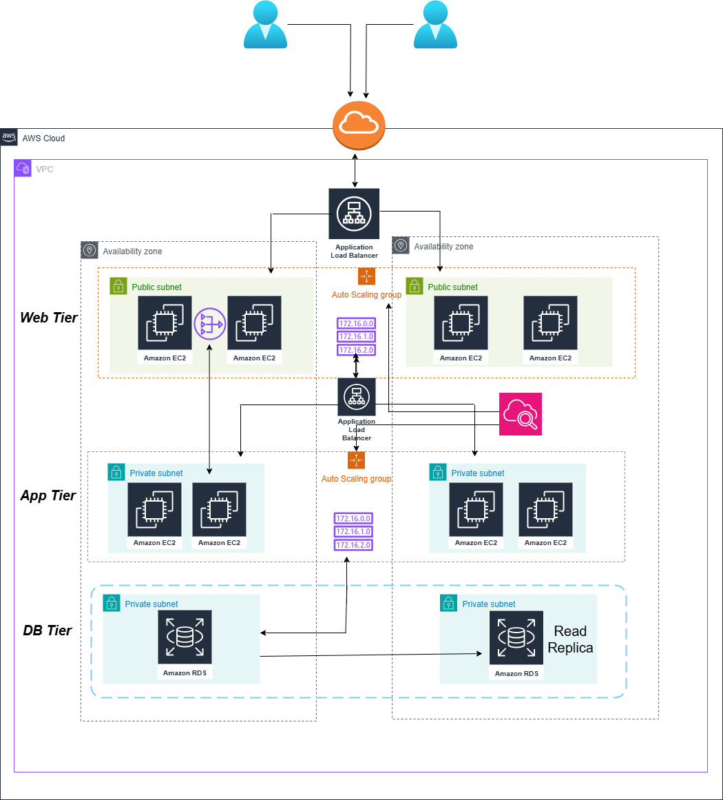

# AWS Three-Tier Architecture

## 🏗️ Overview

This repository contains the design and documentation for a scalable, highly available three-tier web application architecture deployed on Amazon Web Services (AWS). This architecture is perfect for web applications that need to handle varying loads while maintaining high availability and performance.



## 🎯 What This Architecture Does

Imagine you're building a web application (like an e-commerce site or social media platform). This architecture separates your application into three distinct layers:

1. **Web Tier** - Handles user requests and serves web pages
2. **Application Tier** - Processes business logic and application code
3. **Database Tier** - Stores and manages your data

## 📋 Architecture Components

### 🌐 Web Tier (Public Subnet)
- **Amazon EC2 Instances**: Serve web pages to users
- **Application Load Balancer**: Distributes incoming traffic across multiple web servers
- **Auto Scaling Group**: Automatically adds or removes servers based on traffic
- **Public Subnets**: Allow direct internet access for serving web content

### ⚙️ Application Tier (Private Subnet)
- **Amazon EC2 Instances**: Run your application code and business logic
- **Application Load Balancer**: Distributes requests from web tier
- **Auto Scaling Group**: Scales application servers based on demand
- **Private Subnets**: Secure environment with no direct internet access

### 🗄️ Database Tier (Private Subnet)
- **Amazon RDS**: Managed database service for your primary database
- **Read Replica**: Copy of your database for improved read performance
- **Private Subnets**: Maximum security for your sensitive data

## 🏢 Key Features

### ✅ High Availability
- **Multi-AZ Deployment**: Your application runs across two different data centers (Availability Zones)
- **Redundant Components**: If one server fails, others continue serving users


### 📈 Scalability
- **Auto Scaling**: Servers automatically increase during high traffic and decrease during low traffic
- **Load Balancing**: Traffic is evenly distributed across multiple servers
- **Read Replicas**: Database can handle more read operations

### 🔒 Security
- **Network Isolation**: Each tier is isolated in separate subnets
- **Private Subnets**: Application and database tiers are not directly accessible from the internet
- **VPC (Virtual Private Cloud)**: Your own isolated network in AWS

## 🚀 How It Works

1. **User Request**: A user visits your website
2. **Load Balancer**: Routes the request to an available web server
3. **Web Tier**: Web server processes the request and may need data
4. **Application Tier**: Web server forwards request to application server for business logic
5. **Database Tier**: Application server queries database for required data
6. **Response**: Data flows back through the tiers to the user


## 📊 Traffic Flow

```
Internet Users
     ↓
Application Load Balancer
     ↓
Web Tier (EC2 instances)
     ↓
Application Load Balancer
     ↓
App Tier (EC2 instances)
     ↓
Database Tier (RDS + Read Replica)
```


## 📚 AWS Services Used

| Service | Purpose | Tier |
|---------|---------|------|
| EC2 | Virtual servers | Web & App |
| Application Load Balancer | Traffic distribution | Web & App |
| Auto Scaling Group | Automatic scaling | Web & App |
| RDS | Managed database | Database |
| VPC | Network isolation | All |
| Subnets | Network segmentation | All |

## 🔧 Configuration Guidelines

### Web Tier Configuration
- **Instance Type**: t3.medium or t3.large 
- **AMI**: Amazon Linux 2 with web server software
- **Security Group**: Allow HTTP (80) and HTTPS (443) from internet

### Application Tier Configuration
- **Instance Type**: t3.large or m5.large 
- **AMI**: Amazon Linux 2 with application runtime
- **Security Group**: Allow traffic only from Web Tier

### Database Tier Configuration
- **Engine**: MySQL, PostgreSQL, or SQL Server
- **Instance Class**: db.t3.medium or larger
- **Multi-AZ**: Enabled for high availability
- **Security Group**: Allow traffic only from Application Tier

## ⚡ Performance Benefits

- **Load Distribution**: No single point of failure
- **Geographic Spread**: Multi-AZ deployment reduces latency
- **Database Optimization**: Read replicas handle read-heavy workloads
- **Auto Scaling**: Handles traffic spikes automatically

## 💡 Final Thoughts
This architecture follows AWS Well-Architected Framework principles and represents industry best practices. Whether you're a startup launching your first application or an enterprise modernizing existing systems, this design provides the reliability, security, and scalability foundation you need.
Remember: great architecture is not just about the technology—it's about building systems that serve your users reliably while growing with your business needs.


