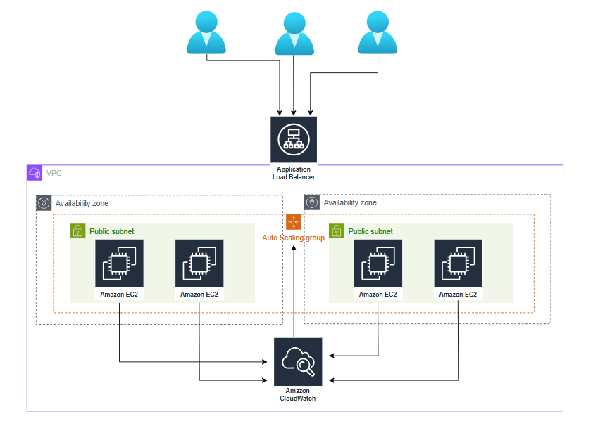

# 🚀 Scalable Web Application on AWS EC2 with AutoScaling and ALB.

## 📋 Project Overview

This project demonstrates the deployment of a **highly available and scalable web application** on AWS using EC2 instances. The architecture implements AWS best practices for compute scalability, security, and cost optimization using core AWS services including Elastic Load Balancing and Auto Scaling Groups.

## 🏗️ Architecture Diagram

The architecture showcases a **multi-tier, multi-AZ deployment** that ensures high availability, automatic scaling, and efficient traffic distribution across multiple EC2 instances.



## 🎯 Project Objectives

- Deploy a secure and scalable EC2-based web application
- Implement high availability using Application Load Balancer (ALB) and Auto Scaling Groups (ASG)

## 🛠️ Key AWS Services Implemented

### **Core Services**
| Service | Purpose | Implementation |
|---------|---------|----------------|
| **Amazon EC2** | Web application hosting | 4 instances across 2 AZs |
| **Application Load Balancer** | Traffic distribution | Layer 7 load balancing |
| **Auto Scaling Group** | Dynamic scaling | Demand-based instance management |
| **Amazon VPC** | Network isolation | Secure private cloud environment |
| **Amazon CloudWatch** | Monitoring & metrics | Performance tracking and alerting |


## 🏛️ Architecture Components

### **1. Application Load Balancer (ALB)**
```
Purpose: Entry point for all incoming traffic
Features:
  ✓ Health checks for backend instances
  ✓ Path-based routing capabilities
  ✓ Cross-zone load balancing
```

### **2. Auto Scaling Group (ASG)**
```
Configuration:
  ✓ Minimum Instances: 2
  ✓ Maximum Instances: 4
  ✓ Desired Capacity: 4
  ✓ Health Check Type: ELB
  ✓ Health Check Grace Period: 300s
```

### **3. Multi-AZ EC2 Deployment**
```
Instance Distribution:
  ✓ Availability Zone A: 2 instances
  ✓ Availability Zone B: 2 instances
  ✓ Instance Type: t3.micro 
  ✓ AMI: Amazon Linux 2 with pre-installed application [launch from template]
```

### **4. VPC Network Architecture**
```
Network Configuration:
  ✓ VPC CIDR: 10.0.0.0/16
  ✓ Public Subnet AZ-A: 10.0.1.0/24
  ✓ Public Subnet AZ-B: 10.0.2.0/24
  ✓ Internet Gateway: Enabled
  ✓ Route Tables: Configured for internet access
```

## 📊 Architecture Benefits

### **🔄 High Availability**
- **Multi-AZ Deployment**: Protects against single AZ failures
- **Health Monitoring**: Automatic replacement of unhealthy instances
- **Load Distribution**: Traffic spread across multiple instances

### **📈 Scalability**
- **Horizontal Scaling**: Automatic instance addition/removal
- **Performance-Based**: Scaling triggers based on CPU, memory, or custom metrics
- **Cost-Effective**: Scale down during low traffic periods

### **🔒 Security**
- **VPC Isolation**: Private network environment
- **Security Groups**: Instance-level firewall rules


### **💰 Cost Optimization**
- **Auto Scaling**: Pay only for resources you need
- **Instance Right-Sizing**: Optimal instance types for workload
- **CloudWatch Monitoring**: Track and optimize resource utilization


## 🎓 Learning Outcomes Achieved

### **✅ Technical Skills Developed**
- **EC2 Management**: Instance lifecycle and optimization
- **Load Balancing**: Traffic distribution strategies
- **Auto Scaling**: Dynamic resource management
- **VPC Networking**: Secure network architecture
- **Monitoring**: CloudWatch implementation

### **✅ AWS Best Practices Applied**
- **High Availability**: Multi-AZ deployment patterns
- **Scalability**: Horizontal scaling implementation
- **Security**: Defense in depth strategies


